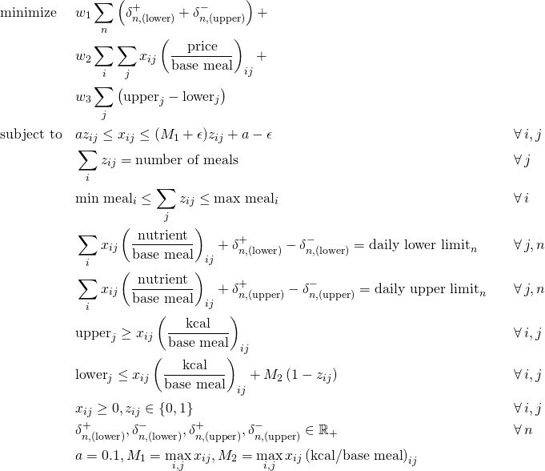

# Optimizing meals

This folder contains an implementation of the optimization model presented in the blogpost about optimizing meals.

## How to run the code

1. Install Python 3.7 on your system, for instance using the Anaconda distribution.
2. Run `pip install -r requirements.txt` to install packages.
3. To test the code, run `pip install pytest` and `pytest optimizing_meals.py --doctest-modules`.
4. If all of the above works, the code should run. Look at the examples in `optimizing_meals.py `.

## Optimization model

The implemented model is roughly shown below.
See the code and article for details.

